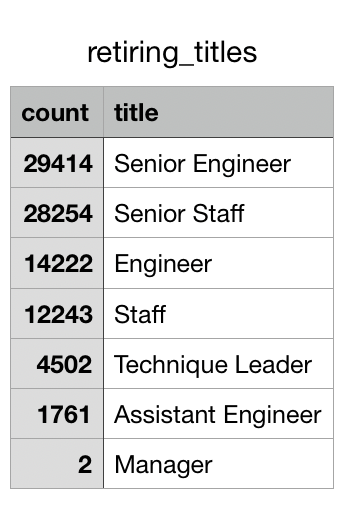

# **Pewlett-Hackard-Analysis**
*Complete analysis on an employee database using SQL techniques*

## Overview of Project:

#### *Purpose:*
A 'silver tusami' is inevitable to the Pewlett-Hackard company as many current employees reach retirement age. In an effort to prepare this change in the company, an analysis on the employee database has been executed using SQL techniques. The Data folder contains additional files that aid in this following analysis. This analysis consists of two main deliverables: 

- Deliverable #1: Determine the number of retiring employees per title
- Deliverable #2: Identify employees who are eligible to participate in a mentorship program

## Results 
Provide a bulleted list with four major points from the two analysis deliverables. Use images as support where needed.

- There are a total of 77,598 employees eligible for upcoming retirement. Of this amount, 29,414 employeees have the title "Senior Engineer" and 2 have the title "Manager". *See the screen-shot images of the reults of the query for retiring titles.*

- Unique Titles
- Retiring Titles
- Mentorship Eligibility: 

#### *Deliverable #1:Determine the number of retiring employees per title*
*Below are the screen-shot images of the reults of the query "Retirment Titles".*

*Below are the screen-shot images of the reults of the query "Unique Titles.*

*Below are the screen-shot images of the reults of the query "Retiring Titles".*

#### *Deliverable #2: Identify employees who are eligible to participate in a mentorship program*
*Below are the screen-shot images of the reults of the query "Mentorship Eligibility".*

## Summary:

1. How many roles will need to be filled as the "silver tsunami" begins to make an impact?

2. Are there enough qualified, retirement-ready employees in the departments to mentor the next generation of Pewlett Hackard employees?

